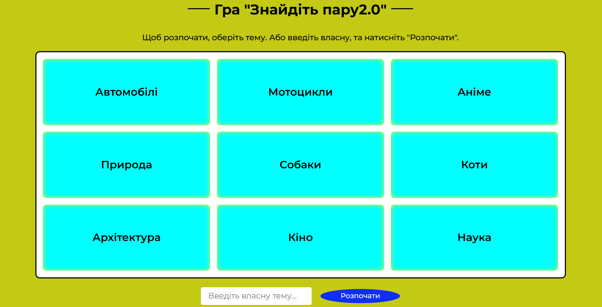
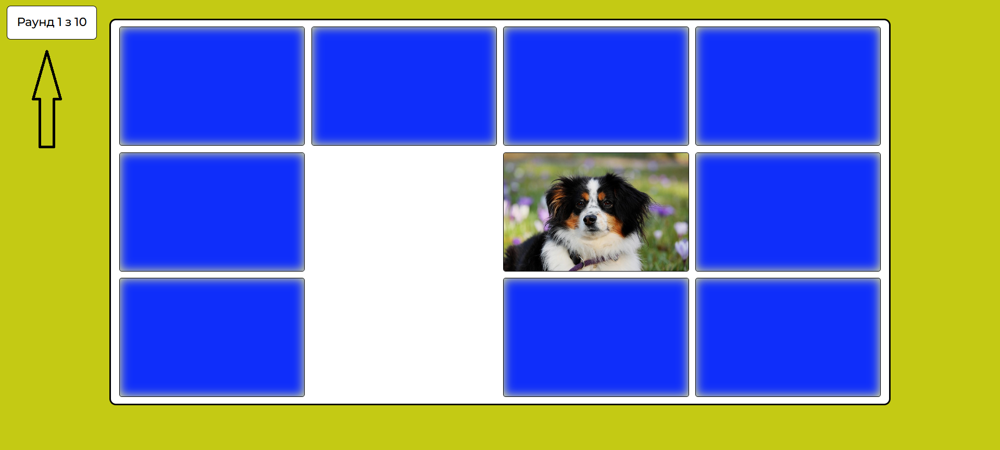
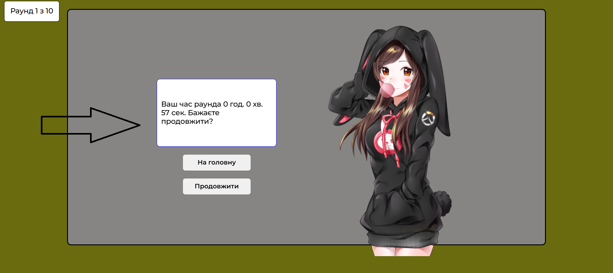

# Get a pair 2.0

Hello everyone! We present to you a new version of the browser game where you
need to match pairs of pictures. This is a revised and improved version.

I hope you enjoy the game.

## What has changed in the new version?

- You can now choose one of nine image themes for the game. You can also enter
  your own theme. All images are downloaded from Pixabay.
  
  
  
- Added 10 difficulty levels.
  
  
  
- After each level, you can choose to continue playing or return to the main
  page. The game time is also displayed after each round. At the end of the
  game, the time for all rounds will be displayed.
  
  
  
- Bugs from the previous version have been fixed. Progress saving has also been
  added. If a crash occurs or you accidentally reload the page, simply select
  the same topic and you'll continue from the current round.

## Tech stack

- 
- The project was compiled
  on
- The axios library was used for
  requests.

## How to use

1. Copy this repository
   ```
   git clone (SSH or HTTPS key)
   ```
2. Install dependencies
   ```
   npm install
   ```
3. Run the project
   ```
   npm run dev
   ```
